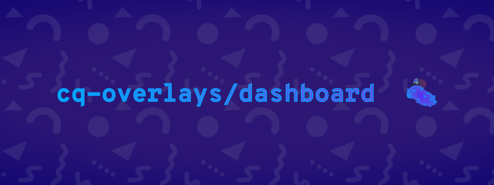

# `cq-overlay-controls`
> A broadcast graphics dashboard for controlling Splatoon tournament overlays

![License][license-shield]
![Stars][stars-shield]
# 

C.Q. Overlay Controls is a NodeCG dashboard bundle for controlling Splatoon tournament overlays. It's decoupled from any overlays to allow anyone to connect their own overlays seamlessly to the dashboard.

It's used in all of the overlays that I build for myself, and all of the overlays that I have been [commissioned](https://ko-fi.com/leptoflare/commissions) for.

This bundle was originally designed for [Off the Dial's overlays](https://github.com/offthedial/overlays), however it has since been refined and remodeled to support splatoon tournament streams of any size and complexity.

- Seamlessly control teams, scores, maps, colors, rosters and more using a single, unified control panel.
- Automatically set map winners when scores are changed.
- Load team data and map data into the dashboard preemptively to save time during the stream.

## Usage <!-- Using the product -->
### Installing NodeCG with this bundle
1. Prerequisites
   1. Make sure you have [Git](https://git-scm.com) installed
   2. Make sure you have [Node (with NPM)](https://nodejs.org) installed
   3. Make sure you have the NodeCG CLI installed: `npm i -g nodecg`
2. Create a new directory and `cd` into it
3. Setup a new NodeCG Instance: `nodecg setup`
4. CD into the bundles directory: `cd bundles/`
5. Install this bundle for production: `git clone -b production https://github.com/LeptoFlare/cq-overlay-controls`
   - The production branch of this repository only contains the built files and the `package.json`, so you do not need to use `npm i`.
   - To update, just use `git pull` as you would any repository.
6. You can now make any other installations that you may need
7. Run NodeCG: `nodecg start`

The dashboard should now be accessible! If you run into any issues or have any questions, feel free to contact me!

### Using the dashboard
The dashboard is mainly self-explanatory and can be easily learned with just a bit playing with it. For those who want a quick run-down, here are some general tips:
- Each panel is draggable and positionable, although NodeCG doesn't give you much flexibility with that.
- All buttons with colored backgrounds will update the overlays directly and instantly. Secondary buttons (no colored backgrounds) usually need their changes to be applied using an "Update" button with a colored background.
- On the `Teams` panel, there is a button in the middle of the scores that resets them.
- Changing the score will attempt to automatically set the map winners.

If you run into any issues or have any questions, feel free to contact me!

### Making your own overlays with this bundle
I've designed this bundle to make it as easy as possible to connect to your own overlay bundles. If you do not know how to code, and/or would be interested in commissioning me to make them for you, please see my [ko-fi](https://ko-fi.com/leptoflare/commissions)!

The way you connect to the dashboard controls is exclusively with replicants.
> ```js
> const currentTeams = nodecg.Replicant("currentTeams", "cq-overlay-controls");
>
> currentTeams.on("change", (newValue, oldValue) => {
>   // Write some logic here
> }
> ```

The documented list of all the avaliable replicants are avaliable in the [schemas](/schemas) folder. Each file is the [JSON Schema](https://json-schema.org) for the corresponding replicant. There is also a `"default"` key that stores an example of what the replicant value might look like.

For more information on how to build your own bundles, see the [NodeCG documentation](https://www.nodecg.dev/docs/creating-bundles). If you run into any issues or have any questions, feel free to contact me!

## Contributing <!-- Using the source -->
1. Fork the repository and clone it.
2. Make a new branch to submit your pull request from.

### Running locally
1. Follow the steps in [Installing NodeCG](#installing-nodecg-with-this-bundle), **stop after step 3**
2. Install this bundle for development: `nodecg install LeptoFlare/cq-overlay-controls --dev`
3. CD into the bundle directory: `cd bundles/cq-overlay-controls`
4. Start the development server: `npm run dev`
5. Create a new window to start NodeCG from, and run NodeCG: `nodecg start`

---

Contact me · [**@LeptoFlare**](https://github.com/LeptoFlare) · [lepto.tech](https://lepto.tech)

As always, distributed under the MIT license. See `LICENSE` for more information.

_[https://github.com/LeptoFlare/cq-overlay-controls](https://github.com/LeptoFlare/cq-overlay-controls)_

<!-- markdown links & imgs -->
[stars-shield]: https://img.shields.io/github/stars/LeptoFlare/cq-overlay-controls.svg?style=social
[license-shield]: https://img.shields.io/github/license/LeptoFlare/cq-overlay-controls.svg?style=flat
